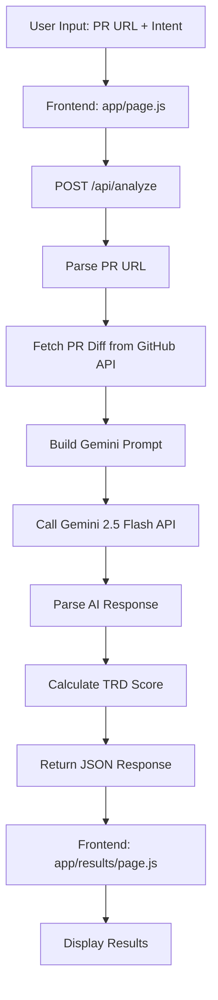

# BobWatch Gemini Integration - Implementation Plan

## Overview
Integrate Google Gemini 2.5 Flash to analyze GitHub Pull Request changes against user intent, categorizing modifications as Intended, Collateral, or Risky.

---

## Architecture Overview



---

## Implementation Steps

### 1. Install Dependencies
**Package:** `@google/generative-ai`
```bash
npm install @google/generative-ai
```

### 2. Environment Configuration
**File:** `.env.local`
```env
GEMINI_API_KEY=your_api_key_here
```

**Security Note:** `.env.local` is already in `.gitignore` ✓

---

### 3. GitHub API Integration

#### PR URL Parsing
**Input Format:** `https://github.com/owner/repo/pull/123`

**Extract:**
- `owner`: Repository owner
- `repo`: Repository name  
- `pull_number`: PR number

#### GitHub API Endpoint
```
GET https://api.github.com/repos/{owner}/{repo}/pulls/{pull_number}/files
```

**Response Structure:**
```json
{
  "files": [
    {
      "filename": "src/auth/login.js",
      "status": "modified",
      "additions": 15,
      "deletions": 3,
      "changes": 18,
      "patch": "@@ -10,7 +10,7 @@ function login() {...}"
    }
  ]
}
```

**Key Data to Extract:**
- `filename`: File path
- `patch`: Actual code changes (diff format)
- `status`: added/modified/removed/renamed

---

### 4. Gemini Prompt Engineering

#### System Prompt Template
```
Act as a Senior Security Engineer reviewing code changes.

USER INTENT:
{userIntent}

CODE CHANGES:
{formattedDiff}

TASK:
Analyze each modified file and categorize changes into:

1. INTENDED - Changes that directly fulfill the user's stated intent
2. COLLATERAL - Unintended but necessary side effects (refactoring, dependency updates, etc.)
3. RISKY - Changes that introduce security vulnerabilities, break functionality, or deviate dangerously from intent

For RISKY items, explain the EXACT security danger or risk.

OUTPUT FORMAT (JSON):
{
  "risky": [
    {
      "filename": "path/to/file.js",
      "explanation": "Specific security risk explanation"
    }
  ],
  "collateral": [
    {
      "filename": "path/to/file.js", 
      "explanation": "Why this is a side effect"
    }
  ],
  "intended": [
    {
      "filename": "path/to/file.js",
      "explanation": "How this fulfills the intent"
    }
  ]
}
```

#### Diff Formatting Strategy
```javascript
// Format each file change as:
File: src/auth/login.js
Status: modified
Changes: +15 -3

Diff:
@@ -10,7 +10,7 @@ function login() {
-  const token = localStorage.getItem('token');
+  const token = sessionStorage.getItem('token');
   return token;
}
```

---

### 5. API Route Implementation

**File:** `app/api/analyze/route.js`

#### Core Logic Flow
```javascript
1. Validate request body (githubUrl, userIntent)
2. Parse PR URL → extract owner, repo, pull_number
3. Fetch PR files from GitHub API
4. Format diff data for Gemini
5. Call Gemini API with prompt
6. Parse JSON response from Gemini
7. Calculate TRD score
8. Return standardized response
```

#### TRD Score Calculation
```javascript
// Formula:
const totalFiles = risky.length + collateral.length + intended.length;
const riskyWeight = -20;  // Each risky file reduces score by 20
const collateralWeight = -5;  // Each collateral file reduces score by 5
const intendedWeight = 0;  // Intended files are baseline

let score = 100;
score += (risky.length * riskyWeight);
score += (collateral.length * collateralWeight);
score = Math.max(0, Math.min(100, score)); // Clamp between 0-100
```

#### Response Format
```json
{
  "status": "success",
  "data": {
    "score": 78,
    "risky": [...],
    "collateral": [...],
    "intended": [...]
  }
}
```

---

### 6. Frontend Integration

#### Update `app/page.js`
**Implementation:**
- POST to `/api/analyze` with `{ githubUrl, userIntent }`
- Store response in sessionStorage
- Navigate to `/results` after successful response

```javascript
const handleAnalyze = async () => {
  setIsLoading(true);
  try {
    const response = await fetch('/api/analyze', {
      method: 'POST',
      headers: { 'Content-Type': 'application/json' },
      body: JSON.stringify({
        githubUrl: repoUrl,
        userIntent: instructions
      })
    });
    
    const result = await response.json();
    sessionStorage.setItem('analysisResult', JSON.stringify(result.data));
    router.push('/results');
  } catch (error) {
    // Handle error
  } finally {
    setIsLoading(false);
  }
};
```

#### Update `app/results/page.js`
**Implementation:**
- Read analysis results from sessionStorage
- Display the AI-powered analysis

```javascript
useEffect(() => {
  const storedData = sessionStorage.getItem('analysisResult');
  if (storedData) {
    setData(JSON.parse(storedData));
    sessionStorage.removeItem('analysisResult');
  }
}, []);
```

---

### 7. Error Handling Strategy

#### API Route Error Cases
1. **Invalid PR URL** → 400 Bad Request
2. **GitHub API Rate Limit** → 429 Too Many Requests
3. **PR Not Found** → 404 Not Found
4. **Gemini API Error** → 500 Internal Server Error
5. **Invalid Gemini Response** → 500 Internal Server Error

#### Error Response Format
```json
{
  "status": "error",
  "message": "Human-readable error message",
  "code": "ERROR_CODE"
}
```

#### Frontend Error Handling
- Display user-friendly error messages
- Provide "Try Again" button
- Log errors to console for debugging

---

### 8. Security Considerations

✅ **API Key Protection**
- Store in `.env.local` (server-side only)
- Never expose in client-side code
- Already in `.gitignore`

✅ **Rate Limiting**
- GitHub API: 60 requests/hour (unauthenticated)
- Gemini API: Check quota limits
- Implement retry logic with exponential backoff

✅ **Input Validation**
- Validate PR URL format
- Sanitize user intent input
- Limit input length to prevent abuse

---

### 9. Testing Checklist

- [ ] Valid PR URL returns correct analysis
- [ ] Invalid PR URL returns 400 error
- [ ] Missing GEMINI_API_KEY returns 500 error
- [ ] GitHub API rate limit handled gracefully
- [ ] Gemini API timeout handled
- [ ] Results page displays data correctly
- [ ] Score animation works
- [ ] Card animations stagger properly
- [ ] "New Analysis" button resets state

---

### 10. File Structure

```
bobwatch/
├── .env.local (NEW - create this)
├── .gitignore (already excludes .env.local ✓)
├── package.json (update with new dependency)
├── app/
│   ├── page.js (UPDATE - add API call)
│   ├── results/
│   │   └── page.js (UPDATE - read from sessionStorage)
│   └── api/
│       └── analyze/
│           └── route.js (MAJOR UPDATE - implement Gemini logic)
```

---

## Next Steps

1. **Install Package** → Run `npm install @google/generative-ai`
2. **Create `.env.local`** → Add GEMINI_API_KEY placeholder
3. **Implement API Route** → Build core logic in `route.js`
4. **Update Frontend** → Connect page.js to API
5. **Test End-to-End** → Verify complete flow

---

## Expected Outcome

Users will:
1. Paste a GitHub PR URL
2. Enter their original intent
3. Click "ANALYZE WITH BOBWATCH"
4. See real AI-powered analysis categorizing changes
5. Get a Trust Reality Delta (TRD) score
6. View detailed explanations for each file

**The dashboard displays real AI analysis results!**

---

## Notes

- Gemini 2.5 Flash is fast and cost-effective for this use case
- JSON mode ensures structured responses
- GitHub API is public and doesn't require authentication for public repos
- Session storage prevents data loss on page refresh
- Real-time AI analysis provides accurate security insights
